<div align="center">

# Telecom Customer Churn Analysis & Prediction

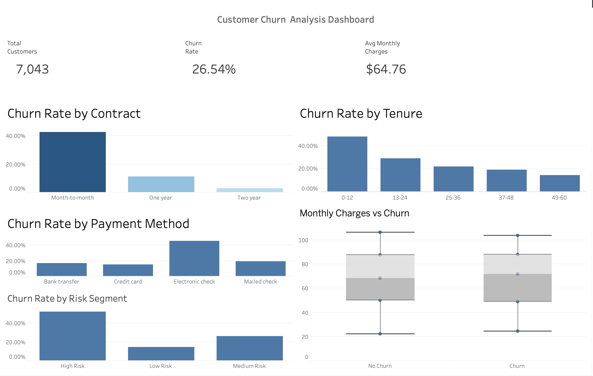

</div>

---

## What is Customer Churn?

Customer churn is when customers stop doing business with a company or service. In the telecom industry, where competition is fierce and switching costs are low, the annual churn rate sits between 15–25%. Retaining an existing customer is significantly cheaper than acquiring a new one — so even modest improvements in churn prediction translate directly to revenue.

This project analyzes a telecom dataset to understand what drives churn and builds a machine learning model to flag at-risk customers before they leave.

## Objectives

- Find the percentage of churned vs. active customers
- Analyze which features are most responsible for churn
- Build a KNN classifier to predict churn risk

---

## Dataset

[Telco Customer Churn — Kaggle](https://www.kaggle.com/datasets/blastchar/telco-customer-churn)

The dataset covers:

- **Churn status** — whether the customer left within the last month
- **Services** — phone, multiple lines, internet, online security, online backup, device protection, tech support, streaming TV and movies
- **Account info** — tenure, contract type, payment method, paperless billing, monthly and total charges
- **Demographics** — gender, senior citizen status, partners, dependents

**Libraries:** pandas, NumPy, matplotlib, seaborn, scikit-learn, kagglehub

---

## Exploratory Data Analysis

### 1. Churn Distribution

> 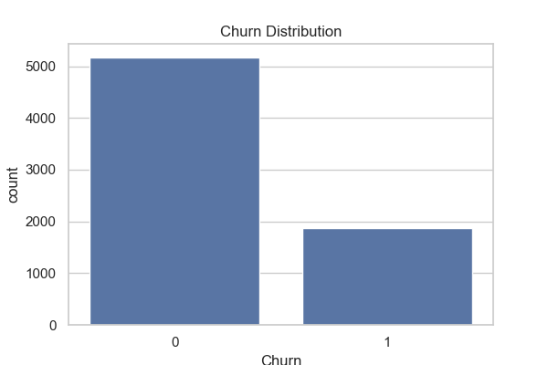

26.54% of customers churned (1,869 of 7,043). The class imbalance is manageable — skewed enough to matter for modeling, but not so extreme that it requires heavy resampling.

---

### 2. Churn by Gender

> 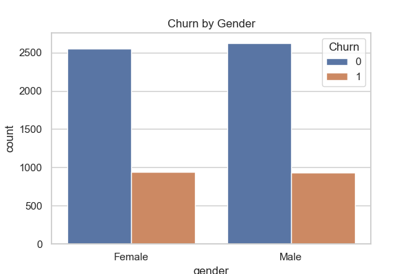

Female and male customers churned at nearly identical rates. Gender has essentially no predictive value here on its own.

---

### 3. Contract Type

> 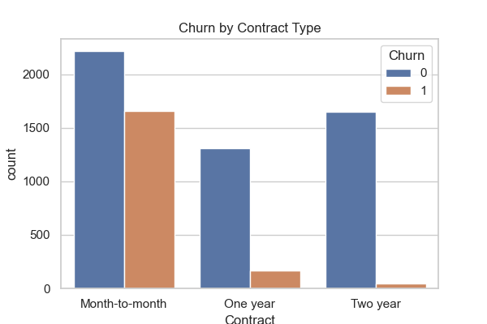

Contract type is one of the strongest churn signals in the dataset. Customers on short-term contracts are far more likely to leave — likely because longer contracts create commitment while month-to-month leaves the door open.

---

### 4. Payment Method

> 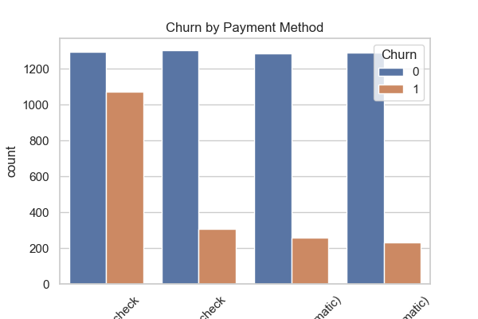

Electronic check users churn at significantly higher rates than customers on automatic payment methods. Customers on automatic payments are likely more passive and less likely to actively cancel.

---

### 5. Internet Service

> 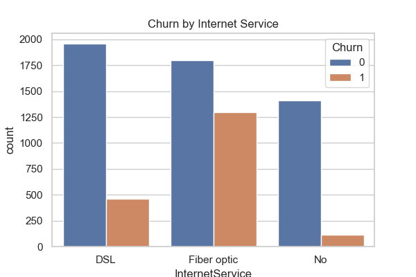

Fiber optic customers churn at more than twice the rate of DSL customers — suggesting dissatisfaction with pricing or service quality at that tier despite it being the premium offering.

---

### 6. Senior Citizens

> 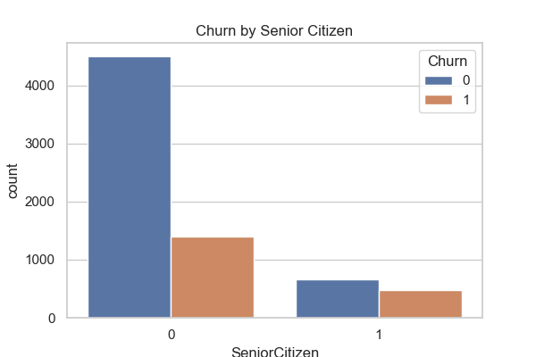

Senior citizens (1,142 customers, ~16% of the base) churn at a notably higher rate than non-seniors — a high-risk segment despite their smaller share of the customer base.

---

### 7. Dependents & Partners

> 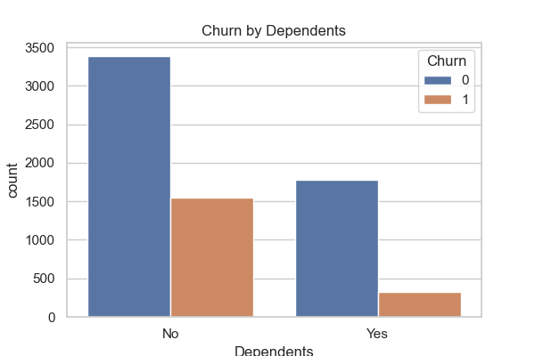

Customers without dependents or partners churn at significantly higher rates. Customers with family commitments appear considerably more stable.

---

### 8. Online Security

> 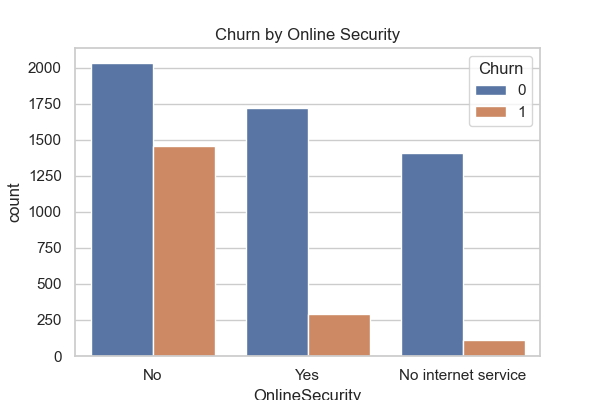

Customers without online security churn at nearly three times the rate of those with it — one of the clearest signals that value-added services drive retention.

---

### 9. Tech Support

> 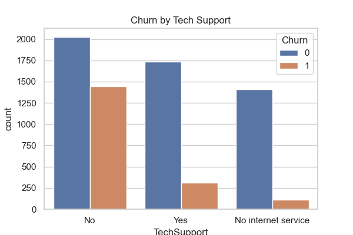

Almost identical pattern to online security. Customers who feel supported stay — those who don't, leave.

---

### 10. Paperless Billing

> 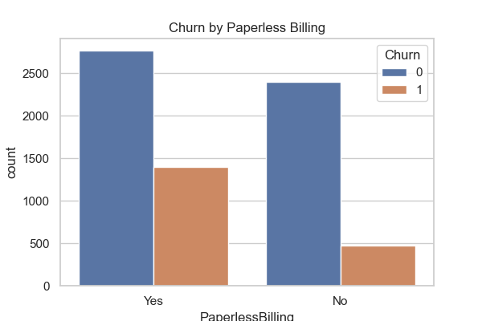

Customers on paperless billing churn at roughly twice the rate of those on paper billing. This likely overlaps heavily with the electronic check payment group — both skew toward a more digitally transient customer segment.

---

### 11. Charges and Tenure

> 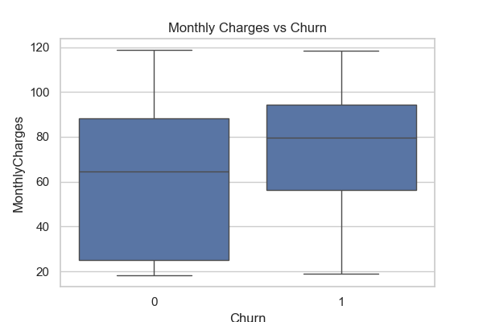
> 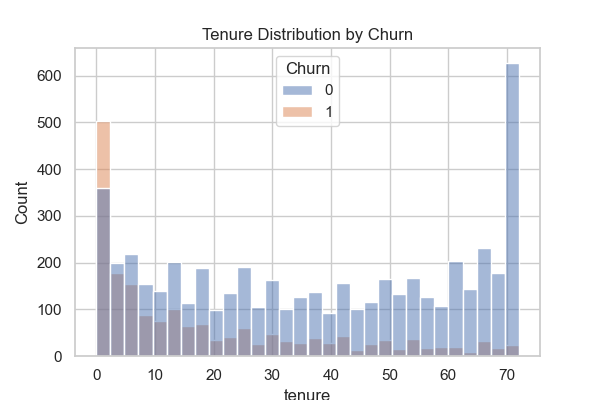

Churned customers had a meaningfully higher median monthly charge than non-churned customers. Churn also drops sharply with tenure — nearly half of all new customers churn within their first year, but the rate falls consistently as tenure increases.

---

### 12. Risk Segmentation

> 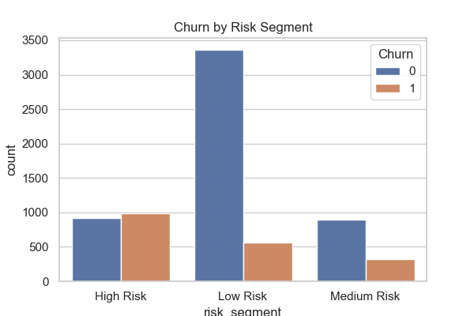

High risk customers churn at over 50% — more than double the rate of medium risk and nearly four times that of low risk. The risk segmentation feature engineered in the cleaned dataset proves to be a strong predictor.

---

## Dashboard

The Tableau dashboard visualizes the key churn drivers across all segments explored above — contract type, tenure, payment method, monthly charges, and risk segmentation.

> 

---

## Machine Learning Model

A **K-Nearest Neighbors (KNN)** classifier was trained to predict customer churn using the following features:

- Tenure
- Monthly charges
- Total charges
- Contract type (one-hot encoded)
- Payment method (one-hot encoded)
- Internet service (one-hot encoded)

Features were standardized with `StandardScaler` before training. The dataset was split 80/20 for train/test.

```python
from sklearn.neighbors import KNeighborsClassifier
from sklearn.preprocessing import StandardScaler

scaler = StandardScaler()
X_train_scaled = scaler.fit_transform(X_train)
X_test_scaled  = scaler.transform(X_test)

knn = KNeighborsClassifier(n_neighbors=5)
knn.fit(X_train_scaled, y_train)
```

### Model Performance

| Metric            | Score |
| ----------------- | ----- |
| Accuracy          | 77.7% |
| ROC AUC           | 0.69  |
| Precision (churn) | 0.60  |
| Recall (churn)    | 0.51  |

> 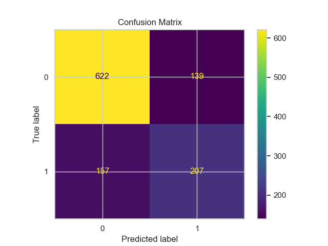

The model correctly identifies the majority of non-churn customers and captures roughly half of actual churners — useful as a baseline for prioritizing retention outreach. Recall on the churn class is the main area to improve.

---

## Optimizations

A few directions to push accuracy further:

- **Hyperparameter tuning** — grid search over `n_neighbors`, distance metrics, and weighting schemes
- **Feature engineering** — charge-to-tenure ratios, interaction terms between service add-ons, binary flags for high-risk combinations (month-to-month + electronic check + fiber optic)
- **Model comparison** — Logistic Regression and Gradient Boosting both tend to outperform KNN on this type of tabular churn data

---

## Project Structure

```
churn-analysis/
├── dashboard/
├── data/
├── images/
│   ├── churn_by_billing.png
│   ├── churn_by_contract.png        # export from Tableau
│   ├── churn_by_dependents.png
│   ├── churn_by_gender.png
│   ├── churn_by_internet.png
│   ├── churn_by_payment.png         # export from Tableau
│   ├── churn_by_risk_segment.png    # export from Tableau
│   ├── churn_by_security.png
│   ├── churn_by_senior.png
│   ├── churn_by_techsupport.png
│   ├── churn_distribution.png
│   ├── dashboard_preview.png
│   ├── monthly_charges.png
│   ├── tenure_churn.png
│   └── confusion_matrix.png         # export from Model
├── Model/
├── notebooks/
├── subscriber_analysis.ipynb
├── requirements.txt
└── README.md
```

## Getting Started

```bash
git clone https://github.com/your-Shrey-Trivedi-18/churn-analysis.git
cd churn-analysis

pip install -r requirements.txt

# Run EDA
jupyter notebook subscriber_analysis.ipynb
```
